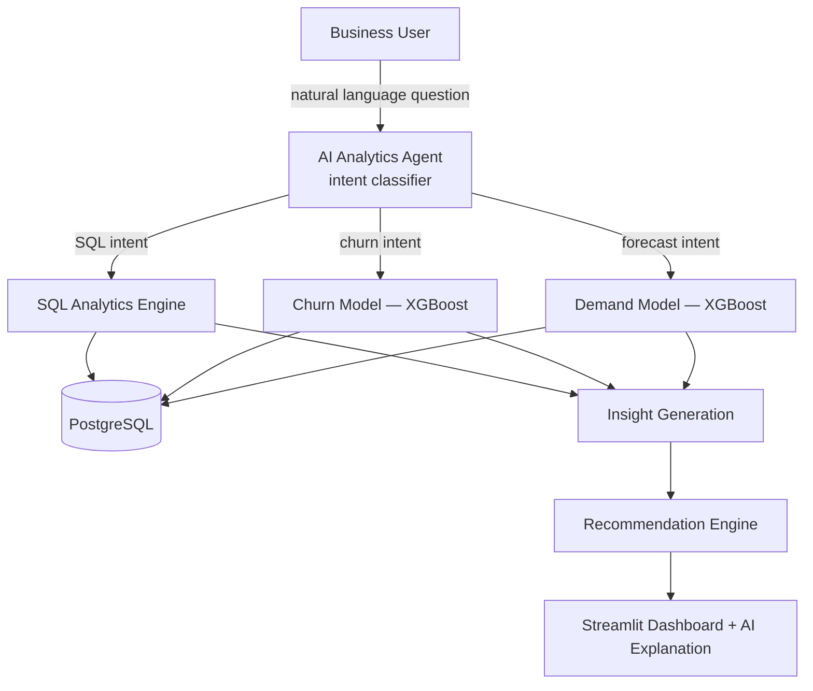

<div align="center">


<a href="https://github.com/Om20An00/AI-Buisness-Intelligence-Platform">
  
</a>

<br/>


### 🔗 [**Live Demo — insightpilot-frontend.onrender.com**](https://insightpilot-frontend.onrender.com/)

<sub>⏳ Hosted on Render's free tier — spins down after inactivity, first load may take ~50s to wake up</sub>

</div>

---

## 📖 About This Project

An **AI Buisness Intelligence Platform** — the kind of internal tool a data
analytics team builds for a business stakeholder who doesn't write SQL. Ask a
question in plain English, and the system routes it to the right engine: a
SQL query, an ML churn prediction, or a demand forecast — then returns the
data, a plain-English insight, and a concrete recommendation.

Internally the backend service is titled `InsightPilot` (visible in the API
docs at `/docs`) — that's the engine's working name, not a separate product.

> 🧠 **Author's note:** Designed and built end-to-end by me — data model,
> synthetic dataset generation, two trained ML models, the natural-language
> routing agent, the API, the dashboard, and the live deployment — as a
> hands-on project applying analytics engineering + applied ML together.

---

## 🏗️ Architecture



---

## ✨ Features

| Category | What's Implemented |
|---|---|
| **NL Agent** | Regex/keyword-based intent classifier — routes a question to SQL, churn, or forecasting instantly, with zero LLM cost |
| **SQL Analytics** | Parameterized queries for revenue, top customers, product performance, and stock levels |
| **Churn Prediction** | XGBoost classifier trained on tenure, spend, support tickets, recent order activity — **0.95 holdout AUC** |
| **Explainability** | Per-customer top risk factors, computed relative to the customer base (no black box) |
| **Demand Forecasting** | XGBoost regressor with lag/rolling/seasonal features, walk-forward daily forecasts — **~3 units/day MAE** |
| **Insight Generation** | Deterministic template engine by default (zero cost); optional real LLM call via OpenAI, with automatic fallback |
| **Recommendation Engine** | Rule-based, transparent, auditable business actions — retention outreach, reorder quantities, etc. |
| **Dashboard** | Streamlit — chat interface, KPI dashboard, churn explorer, forecast explorer |
| **Deployment** | Docker Compose locally; Render (web services) + Neon (serverless Postgres) in production |

---

## 🛠️ Tech Stack

<div align="center">


</div>

| Layer | Technology |
|---|---|
| **Backend API** | FastAPI, Pydantic, Uvicorn |
| **Database** | PostgreSQL, SQLAlchemy |
| **Data Processing** | Pandas, NumPy |
| **ML — Churn** | XGBoost (classification) |
| **ML — Forecasting** | XGBoost (regression), walk-forward inference |
| **AI Explanation** | OpenAI (optional) + rule-based fallback |
| **Frontend** | Streamlit |
| **Deployment** | Docker, Docker Compose, Render, Neon |

---

## 🚀 Getting Started

### Prerequisites

- Docker Desktop (includes Docker Compose)
- (Optional) VS Code with the *Python* and *Docker* extensions

### 1. Clone the repository

```bash
git clone https://github.com/Om20An00/AI-Buisness-Intelligence-Platform.git
cd AI-Buisness-Intelligence-Platform
```

### 2. Run everything with one command

```bash
docker compose up --build
```

| Service | URL | What it does |
|---|---|---|
| `postgres` | internal (host `5433`) | Synthetic retail dataset |
| `backend` | http://localhost:8000/docs | FastAPI — agent, ML models, analytics |
| `frontend` | http://localhost:8501 | Streamlit dashboard + chat UI |

First boot takes ~30–60s — the backend waits for Postgres, seeds a synthetic
dataset (600 customers, 16 products, ~14k orders with a year of demand
history), then trains both ML models before serving traffic. It's idempotent,
so subsequent runs start instantly.

```bash
# Full reset
docker compose down -v && docker compose up --build
```

### 3. Ask it something

Open [http://localhost:8501](http://localhost:8501) and try:

- *"Which customers are at risk of churn?"*
- *"What was our revenue in the North region last 30 days?"*
- *"Forecast demand for Electronics next 14 days"*
- *"Any products running low on stock?"*
- *"Who are our top 10 customers?"*

---

## 🔌 API Quick Reference

Full interactive docs live at `/docs` (Swagger UI).

```bash
# Ask a question through the AI agent
curl -X POST http://localhost:8000/api/query \
  -H "Content-Type: application/json" \
  -d '{"question": "Which customers are at risk of churn?"}'

# Single customer churn detail
curl http://localhost:8000/api/churn/372

# Demand forecast for a category
curl "http://localhost:8000/api/forecast?category=Electronics&days=14"

# Dashboard KPIs
curl http://localhost:8000/api/dashboard/kpis
```

---

## ☁️ Live Deployment — Render + Neon

The platform is deployed as two Render web services backed by a serverless
Neon PostgreSQL database:

**🔗 Live URL:** [https://insightpilot-frontend.onrender.com/](https://insightpilot-frontend.onrender.com/)

| Detail | Value |
|---|---|
| **Frontend** | Render free web service (Docker), Streamlit |
| **Backend** | Render free web service (Docker), FastAPI, binds to Render's injected `$PORT` |
| **Database** | Neon serverless Postgres (free tier, sleeps when idle, wakes on connect) |
| **AI Explanation** | Runs in offline/template mode by default — no OpenAI key configured in production |
| **Cost** | $0 — entirely on free tiers |

> Note: free-tier web services spin down after inactivity; the first request
> after idle can take up to ~50 seconds to wake both services back up.

---

<details>
<summary><h2>🧠 How Each Piece Works — click to expand</h2></summary>

**Data layer.** A synthetic but realistically-structured retail dataset
(customers, products, orders), generated on first boot. Churn labels come
from a documented logistic-style rule (tenure, spend, support tickets +
noise); demand volumes are generated with trend + weekly + monthly
seasonality baked in mathematically, so the models have genuine signal to
learn from — not just noise. Fully disclosed in `backend/app/seed_data.py`.

**AI Analytics Agent.** A lightweight regex/keyword intent classifier
(`backend/app/agent/intent_classifier.py`). No LLM call needed to route a
question — instant and free.

**ML Prediction — Churn.** XGBoost classifier trained on tenure, spend,
support tickets, and recent order activity. Holdout AUC ≈ 0.95. Each
prediction includes the top contributing risk factors, computed relative to
the customer base.

**Forecasting — Demand.** XGBoost regressor trained on lagged/rolling/
seasonal features. Forecasts forward day-by-day using a walk-forward
approach — each prediction feeds back in as the next day's lag feature.

**Insight Generation & Recommendations.** The insight layer works fully
offline by default via deterministic templates — zero external cost. Setting
`OPENAI_API_KEY` enables real LLM-generated explanations, with automatic
fallback if that call fails. The recommendation engine is intentionally
rule-based (not another LLM call) for transparency — every suggestion traces
to a specific, auditable rule.

</details>

---

## 📁 Project Structure

```
AI-Buisness-Intelligence-Platform/
├── docker-compose.yml
├── render.yaml
├── .env.example
├── backend/
│   ├── Dockerfile
│   ├── entrypoint.sh          # wait-for-db → seed → train → serve
│   ├── requirements.txt
│   └── app/
│       ├── main.py            # FastAPI app
│       ├── config.py
│       ├── database.py / models.py / schemas.py
│       ├── seed_data.py       # synthetic dataset generator
│       ├── ml/
│       │   ├── churn_model.py
│       │   └── demand_model.py
│       ├── agent/
│       │   ├── intent_classifier.py
│       │   ├── sql_analytics.py
│       │   ├── insight_generator.py
│       │   └── recommendation_engine.py
│       └── routers/
│           └── query.py, churn.py, forecast.py, dashboard.py
└── frontend/
    ├── Dockerfile
    ├── requirements.txt
    └── streamlit_app.py
```

---

## 📸 Screenshots

<div align="center">

| Home Page | Dashboard |
|:---:|:---:|
|  |  |

| Query Result | Churn Risk |
|:---:|:---:|
|  |  |

| Churn Explorer | Demand Forecast |
|:---:|:---:|
|  |  |

</div>

---

## 🔮 Roadmap / Future Enhancements

- [ ] Swap the regex intent classifier for an optional LLM-based router for messier phrasing
- [ ] Add authentication so the demo can support multiple isolated datasets
- [ ] Persist chat history per session in the dashboard
- [ ] Add more intents (customer lifetime value, cohort retention curves)
- [ ] CI pipeline to retrain/validate models automatically on data changes

---

## 🍴 Forking & Cloning

This repository is open for learning purposes. If you'd like to explore, run,
or build on top of it:

```bash
# Clone directly
git clone https://github.com/Om20An00/AI-Buisness-Intelligence-Platform.git

# Or fork it via the GitHub UI (top-right "Fork" button) to make your own copy
```

If you fork this project or use it as a reference/base for your own work, a
⭐ star or a mention/credit back to this repo is appreciated but not
required. Pull requests with genuine improvements are welcome — please open
an issue first to discuss what you'd like to change.

---

## 👤 Author

**Om** — [@Om20An00](https://github.com/Om20An00)

This project, including its data model, ML pipeline, agent design, API, and
live deployment, was designed and built entirely by me as an independent,
hands-on project.

<div align="center">

If this project helped you or you found it interesting, consider giving it a ⭐!


</div>
